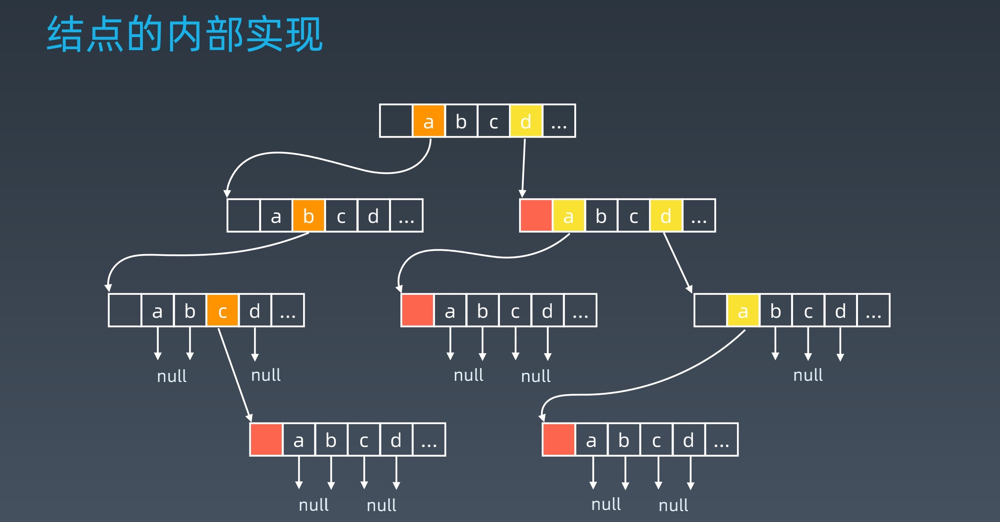

学习笔记

## 字典树（Trie树）
字典树(Trie)，是一种树形结构。典型应用是用于统计和排序大量的字符串(但不仅限于字符串)，所以经常被搜索引 擎系统用于文本词频统计。

它的优点是:最大限度地减少 无谓的字符串比较，查询效率比哈表高。
### 基本性质
1. 结点本身不存完整单词；

2. 从根结点到某一结点，路径上经过的字符连接起来，为该结点对应的
字符串；

3. 每个结点的所有子结点路径代表的字符都不相同。

### 核心思想

空间换时间。

利用字符串的公共前缀来降低查询时间的开销以达到提高效率的目的。

## 并查集 （Disjoint Set）

### 适用 场景
- 组团,配对问题
- Group or not

### 基本操作

• makeSet(s)：建立一个新的并查集，其中包含 s 个单元素集合。

• unionSet(x, y)：把元素 x 和元素 y 所在的集合合并，要求 x 和 y 所在
的集合不相交，如果相交则不合并。

• find(x)：找到元素 x 所在的集合的代表，该操作也可以用于判断两个元
素是否位于同一个集合，只要将它们各自的代表比较一下就可以了。

## 高级搜索

### 初级搜索

1. 朴素搜索

2. 优化方式：不重复（fibonacci）、剪枝（生成括号问题）

3. 搜索方向： 
DFS: depth first search 深度优先搜索 
BFS: breadth first search 广度优先搜索 
双向搜索、启发式搜索

### 剪枝
避免重复性问题

### 回溯算法

回溯法采用试错的思想，它尝试分步的去解决一个问题。在分步解决问题的过程中，当
它通过尝试发现现有的分步答案不能得到有效的正确的解答的时候，它将取消上一步甚
至是上几步的计算，再通过其它的可能的分步解答再次尝试寻找问题的答案。

回溯法通常用最简单的递归方法来实现，在反复重复上述的步骤后可能出现两种情况：

• 找到一个可能存在的正确的答案

• 在尝试了所有可能的分步方法后宣告该问题没有答案

在最坏的情况下，回溯法会导致一次复杂度为指数时间的计算

### 双向BSF

既从A向右边扩散，也从L向左边扩散，直至扩散的结点有重合的地方。把左边扩散的步数加上右边扩散的步数就是总步数。

### 启发式搜索-Heuristic Search (A*)

#### 估价函数
启发式函数： h(n)，它用来评价哪些结点最有希望的是一个我们要找的结
点，h(n) 会返回一个非负实数,也可以认为是从结点n的目标结点路径的估
计成本。

启发式函数是一种告知搜索方向的方法。它提供了一种明智的方法来猜测
哪个邻居结点会导向一个目标。

